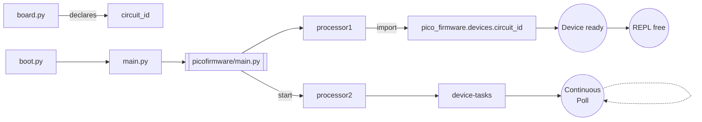

# pico-firmware
Common Control Layer firmware for Raspberry Pi Pico W devices used with  trappy-scopes systems.


## General structure and execution map

‡ : not `.gitignored`

§ : configuration files

♰ : automatically created by `pico_firmware/main.py` after first execution

```
pico_firmware <repository>
    +
    |- vault            # storage/checkpoints/logfiles
‡♰ 	|- boot.py           
♰ 	|- main.py          # Either specialised or calls pico_firmware/main.py
§♰  |- board.py         # board_id and configuration
§♰  |- webrepl_cfg.py   # Web-repl credentials
‡   |- pico_firmware    # ---------------  ↓ Common firmware ↓ --------------------
    :   |- main.py     
    :   |- devices      # device specific files that 
 §	: 	|- secrets.py
 §	: 	|- pinassignments.py
    :   |- actuators
    :   |- sensors
    :   |- controllers
    :   |- peripherals # includes monitors
    :   :   |- beacon.py
    :   :   |- buzzer.py
    :   |- dev         # development directory
    :   |- core
    :   :   |- logging.py
    :   :   |- action.py
    :   :   |- dtsync.py
    :   :   |- processor2.py
    :   :   |- wifi.py
    :   :   |- mqtt.py
    :   :   |- handshake.py
    :   :   |- actionset.py
    :   :   |- test.py
    :   |- processing
    :   :   |- averager.py
    :		*
    *
```


### Execution schemantics



### List of device tasks

1. Connect to wifi
2. Date & time synchronisation using NTP servers
3. Machine autoresets
4. Periodic garbage collection

## Reading device state through indicators

| Indicator state                          | Device status                                             |
| ---------------------------------------- | --------------------------------------------------------- |
| Blinking on-board LED (`0.5Hz`)          | Nomainal operation & device connected to the network      |
| Lit on-board LED                         | Normal operation but device not connected to the network. |
| Very fast blinking on-board LED (`~5Hz`) | Fatal error                                               |
| Blinking red beacon LED/Buzzer           | Acquisition/Experiment in progress                        |
| Lit red beacon LED/Buzzer                | Device waiting for acquisition (thread is sleeping)       |
| Off red beacon LED/Buzzer                | Device on standby - not acquiring any images.             |


## Base device configuration : `board.py`

```python
# TRAPPY-SCOPES: BOARD CONFIGURATION ###
name = "picodev"
circuit_id = "idle_device_that_blinks"
flag_wifi_connect = True
flag_wifi_autoreset = True
flag_dt_sync = True
```


```mermaid
graph LR
```