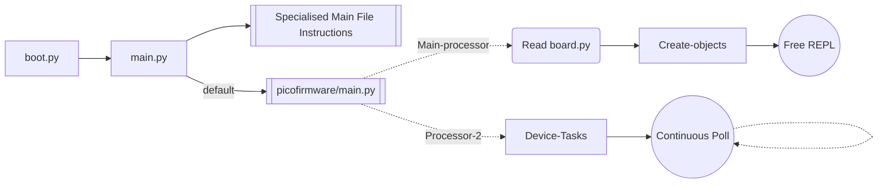

# pico-firmware
Common Control Layer for Pico devices on the trappy-scopes.

This repo defines the common firmware present on all pico boards of Trappy-Scopes systems.

## Responsibilities defined by the common firmware

1. **Handshake** of the device. Exchange of UUIDs, etc.
2. Connection to the wifi and handling/posting of web requests.
3. Common `Action`, `Averager`, and `Logger` classes.
4. Common Hardware basics: `Buzzer` class.
5. Common Sensor Data Sharing Framework
6. Temperature and Humidity sensor control code. (Because he is ubiquitous)
7. Wifi connection protocol and reconnection requests on Processor II.
8. Notifications pushes on Core II requests.
9. Synchronisation of Date and Time over the internet.


## Execution Schematics




## Processor-2 Device-Tasks

```mermaid
graph LR
	Processor-2-Thread --> Garbage-Collection --> 
```


## Error-Percolation

1. Blinking on-board LED (`0.5Hz`): Normal execution - device connected to the network.
2. Lit on-board LED: Normal execution but device not connected to the network.
3. Very fast blinking on-board LED (`~5Hz`): Fatal error.
4. Blinking red beacon LED: Acquisition in progress.
5. Lit red beacon LED: Device waiting for acquisition (thread is sleeping).
6. Off red beacon LED: Device on standby - not acquiring any images.

## Date-Time Synchronisation

1. TODO: The Timezone is set to GMT (+00:00) by default. It is offset to Portugal (Lisbon) time by now. Does not work well with Daylight Savings Time.
2. After every sync event, the change is written to a "dtsync.txt" log file.

## Push Notifications

The following fields must be present in the `secrets.py` file:
	+ not_token
	+ not_user_key

```mermaid
graph LR
```